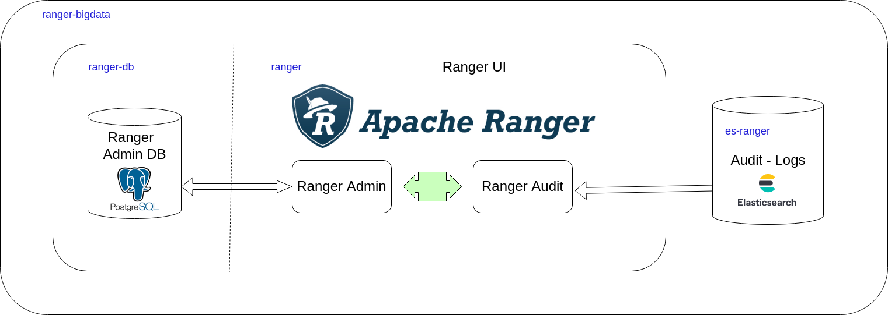
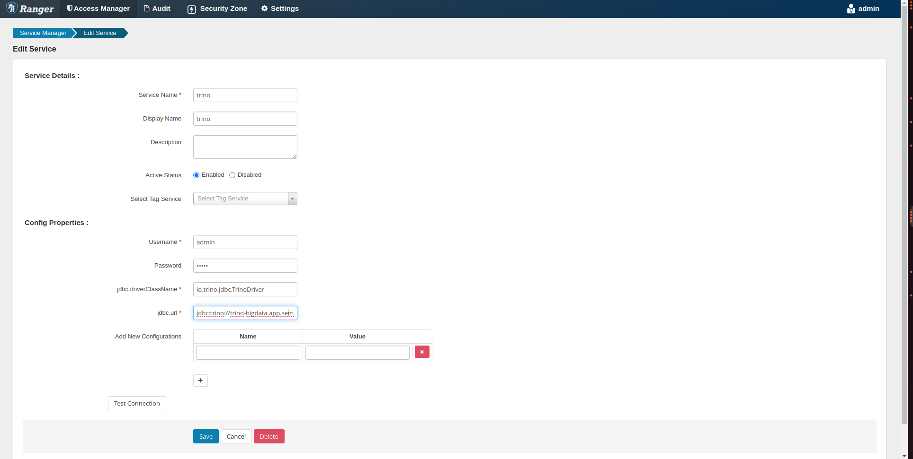

# Apache Ranger 

Este documento apresenta proposta de  deployment de componente Apache Ranger para a plataforma de Big Data SEMA-DF


## Definição

O Apache Ranger é uma plataforma de gerenciamento de segurança de dados de código aberto que ajuda a proteger os dados armazenados em um ecossistema de Big Data. Ele fornece uma interface centralizada para gerenciar as políticas de segurança para várias tecnologias do ecossistema Hadoop, como HDFS, Hive, HBase, Kafka, Solr, Storm, Trino, etc.

Com o Apache Ranger, os administradores podem definir políticas de acesso aos dados com base em usuários, grupos, recursos, ações, horários, entre outros fatores. Isso permite que as organizações controlem quem pode acessar quais dados e o que eles podem fazer com esses dados. O Ranger também fornece recursos para auditoria de acesso aos dados, permitindo que as organizações monitorem e relatem sobre atividades suspeitas ou fora do padrão.

O Apache Ranger é altamente configurável e extensível, permitindo que as organizações personalizem as políticas de segurança de acordo com suas necessidades específicas. Ele também integra-se com outras soluções de gerenciamento de segurança, como o Apache Knox e o Apache Atlas, para fornecer uma solução completa de gerenciamento de segurança de dados.

## Arquitetura 





#### Docker images

| Nome | Descrição | 
|---|---|
| postgres:13  | Banco de dados Postgres que armazenam os metadados do Ranger |  
| docker.elastic.co/elasticsearch/elasticsearch:7.12.1  | ElasticSearch com repositório de dados de auditoria   | 
| docker.app.sema.df.gov.br/bigdata/ranger-trino:2.1.0  | Apache Ranger customizado com plugin para o Trino     | 

### Volumes

Para fins de persistência dos dados do Apache Ranger, criamoos os seguintes volumes:


| Nome | Ponto de Montagem | Tamanho Mínino | Descrição | 
|---|---|---|---| 
| postgres-ranger-pv-claim  | /var/lib/postgresql/data | 10 Gb | Persistencia do banco de metadados do Ranger (Psotgres)|  
| es-pv-claim  | /usr/share/elasticsearch/data | 20 Gb | Persistencia dos logs de auditoria do Ranger(Elasticsearch)  | 


### URLS

As seguintes urls serão expostas nesta implantação:


| Nome |  Descrição | 
|---|---| 
| https://ranger-bigdata.app.sema.df.gov.br/ | Acesso a interface Ranger Admin. | 


### Segurança

Esta implentação esta configurada com  o mecanismo de segurança  default, isto é, todo controle de acesso é feito  no prórprio  Ranger.

Para acessar a aplicação utize o usuario e senha padrão:

* Usuário: admin
* Senha: Rangeradmin1 

Recomenda-se alterar estas senhas logo após o deployment da aplicação. Ver ranger-deployment-cfg.yaml para referencia a senhas do Ranger na instalação.


### Passo a passo de Instalação

#### 1. Criando o namespace

```
kubectl create namespace ranger-bigdata

```

#### 2. Gerando imagem Docker (opcional)


```
cd datalake/ranger/docker 

docker build -t bigdata/ranger-trino:<nova_versao>  .

docker tag  bigdata/ranger-trino:<nova_versao>  docker.app.sema.df.gov.br/bigdata/ranger-trino:<nova_versao>

docker push  docker.app.sema.df.gov.br/bigdata/ranger-trino:<nova_versao>
```

Altere a refrência a mesma no arquivo ranger-deployment.yaml


#### 3. Implantando o Postgres

```
kubectl apply -n ranger-bigdata  -f postgres-ranger-deplyoment.yaml

```

#### 4. Implantando o Elasticsearch

```
kubectl apply -n ranger-bigdata  -f es-ranger-deplyoment.yaml

```

#### 5. Implantando o Config Map com configuração de instalação

```
kubectl apply -n ranger-bigdata  -f ranger-deployment-cfg.yaml

```

#### 6. Implantando o Apache Ranger

```
kubectl apply -n ranger-bigdata  -f ranger-deployment.yaml

```

#### 7. Configurando o Trino Service no Apache Ranger

* No painel Service Manager, crie um service manager do tipo TRINO, ícone +  'Add New Service'
* Preencha os formulário com os dados do serviço conforme tela abaixo:



No campo jdbc.url, informe o seguinte valor: jdbc:trino://trino-bigdata.app.sema.df.gov.br:443/hive?SSL=true&SSLVerification=NONE


