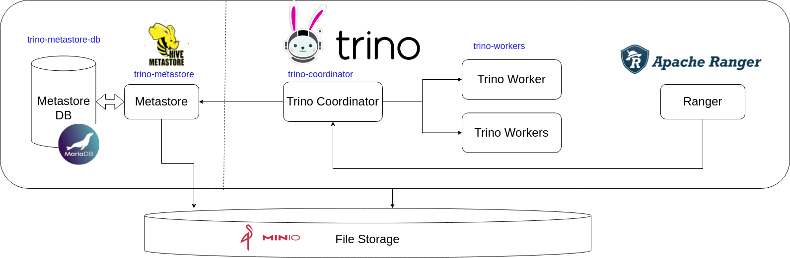

# Trino 

Este documento apresenta proposta de  deployment de componente Trino para a plataforma de Big Data SEMA-DF


## Definição

O Apache Trino, anteriormente conhecido como Presto SQL, é um motor de consulta distribuído de código aberto que permite que as organizações consultem grandes conjuntos de dados em múltiplas fontes de dados de forma rápida e eficiente. Ele foi criado pelo Facebook e, em seguida, doado para a Apache Software Foundation, onde agora é mantido como um projeto de software livre.

O Trino é projetado para executar consultas SQL federadas em uma ampla variedade de fontes de dados, incluindo Hadoop Distributed File System (HDFS), Amazon S3, Microsoft Azure, Cassandra, MySQL e PostgreSQL, entre outros. Ele é construído em torno de um sistema de cluster de nós que permite que os dados sejam distribuídos e consultados em paralelo, o que leva a consultas mais rápidas e eficientes.

O Trino é altamente escalável e pode ser dimensionado para lidar com grandes volumes de dados e muitos usuários simultâneos. Ele é executado em um ambiente de cluster em que os nós são adicionados conforme necessário para aumentar a capacidade de processamento. Além disso, o Trino é altamente personalizável e extensível, permitindo que os usuários adicionem suas próprias funções e conectores de dados personalizados.

O Trino é amplamente utilizado por empresas de tecnologia e organizações que precisam analisar grandes volumes de dados. Ele é considerado uma alternativa de código aberto e de alto desempenho aos sistemas tradicionais de armazenamento e análise de dados.

## Arquitetura 





#### Docker images

| Nome | Descrição | 
|---|---|
| mariadb/server:latest  | Banco de dados MariaDB que armazenam os metadados do Metastore |  
| docker.app.sema.df.gov.br/bigdata/trino-metastore:3.0.0  | Metastore customizado para integração com Minio   | 
| docker.app.sema.df.gov.br/bigdata/trino:406  | Trino coordinator /workerscustomizado com plugin para o Ranger e integração com o Minio     | 


### Volumes

Para fins de persistência dos dados do Apache Trino, criamoos os seguintes volumes:


| Nome | Ponto de Montagem | Tamanho Mínino | Descrição | 
|---|---|---|---| 
| mariadb-trino-metastore-pv-claim  | /var/lib/mysql | 20 Gb | Persistencia do banco de metadados do Metastore (MariaDB)| 


### URLS

As seguintes urls serão expostas nesta implantação:


| Nome |  Descrição | 
|---|---| 
| https://trino-bigdata.app.sema.df.gov.br | Acesso a interface Trino Admin. | 


### Segurança

Todo acesso ao Trino é feito mediante configuração de grupos LDAP. Para utilizar o Trino, cadastre um usuario no LDAP (https://openldap-ui-bigdata.app.sema.df.gov.br/)
e adicione o mesmo em um dos seguintes grupos:

* TrinoUsers - Grupo para  qualeur usuário que acessa o trino. Usuarios que não estiverem neste grupo não poderão acessar o Trino.

No trino , a autorização de acesso aos dados é feita mediante política de acesso no Ranger.


### Passo a passo de Instalação

#### 1. Criando o namespace

```
kubectl create namespace trino-bigdata
```

#### 2. Gerando imagem Docker (opcional)

Para a imagem do metastore:

```
cd datalake/trino/docker/metastore 

docker build -t bigdata/trino-metastore:3.0.0  .

docker tag  bigdata/trino-metastore:3.0.0  docker.app.sema.df.gov.br/bigdata/trino-metastore:3.0.0

docker push  docker.app.sema.df.gov.br/bigdata/trino-metastore:3.0.0
```

Altere a refrência a mesma no arquivo trino-metastore-deployment.yaml


Para a imagem do trino:

```
cd datalake/deployments/trino/docker/trino 

docker build -t bigdata/trino:406  .

docker tag  bigdata/trino:406  docker.app.sema.df.gov.br/bigdata/trino:406

docker push  docker.app.sema.df.gov.br/bigdata/trino:406
```

#### 3. Implantando o Metastore

Vá para o diretório `datalake/deployments/trino/` Execute a seguinte sequencia de comandos:

```
kubectl apply -n trino-bigdata  -f  mariadb-trino-metastore.yaml

kubectl apply -n trino-bigdata  -f  trino-metastore-cfg.yaml

kubectl apply -n trino-bigdata  -f  trino-metastore-initschema.yaml

kubectl apply -n trino-bigdata  -f  trino-metastore-deployment.yaml
```

#### 4. Implantando o Trino

Execute a seguinte sequencia de comandos:

```
kubectl create configmap trino-keystore --from-file=keystore.jks -n trino-bigdata

kubectl apply -n trino-bigdata  -f  trino-cfg.yaml

kubectl apply -n trino-bigdata  -f trino-deployment.yaml

kubectl apply -n trino-bigdata  -f trino-worker-hpa.yaml

```

Após o término do deployment, acesse a interface do Trino pela url  https://trino-bigdata.app.sema.df.gov.br


